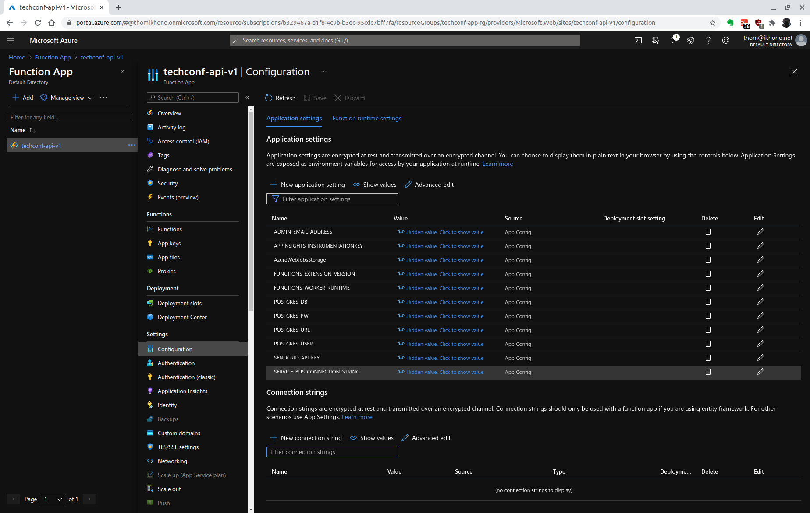

# TechConf Registration Website

- [Introduction](#introduction)
- [Getting Started](#getting-started)
- [Dependencies](#dependencies)
- [Instructions](#instructions)
  - [Create Azure Resources and Deploy Web App](#create-azure-resources-and-deploy-web-app)
    - [Login with Azure CLI](#login-with-azure-cli)
    - [Create a Resource Group](#create-a-resource-group)
    - [Create an Azure Postgres Database single server](#create-an-azure-postgres-database-single-server)
    - [Create a Service Bus resource](#create-a-service-bus-resource)
    - [Configuration](#configuration)
    - [Create a storage account](#create-a-storage-account)
    - [Test web app locally](#test-web-app-locally)
    - [Create App Service plan and deploy the web app](#create-app-service-plan-and-deploy-the-web-app)
  - [Create and Publish Azure Function](#create-and-publish-azure-function)
    - [Create Azure Function](#create-azure-function)
    - [Publish the Azure Function](#publish-the-azure-function)
  - [Refactor `routes.py`](#refactor-routespy)
- [Monthly Cost Analysis](#monthly-cost-analysis)
- [Architecture Explanation](#architecture-explanation)
- [Screenshots](#screenshots)
  - [Migrate Web Applications - 2 Screenshots](#migrate-web-applications---2-screenshots)
  - [Migrate Database - 2 Screenshots](#migrate-database---2-screenshots)
  - [Migrate Background Process - 4 Screenshots](#migrate-background-process---4-screenshots)
- [Clean-up](#clean-up)
- [References](#references)
- [Requirements](#requirements)
- [License](#license)

## Introduction

The TechConf website allows attendees to register for an upcoming conference. Administrators can also view the list of attendees and notify all attendees via a personalized email message.

The application is currently working but the following pain points have triggered the need for migration to Azure:

- The web application is not scalable to handle user load at peak
- When the admin sends out notifications, it's currently taking a long time because it's looping through all attendees, resulting in some HTTP timeout exceptions
- The current architecture is not cost-effective

This project accomplishes the following:

- Migrates and deploys the pre-existing web app to an Azure App Service
- Migrates a PostgreSQL database backup to an Azure Postgres database instance
- Refactors the notification logic to an Azure Function via a service bus queue message

## Getting Started

1. Clone this repository
2. Ensure you have all the dependencies
3. Follow the instructions below

## Dependencies

You will need to install the following locally:

- [PostgreSQL](https://www.postgresql.org/download/)
- [Visual Studio Code](https://code.visualstudio.com/download)
- [Azure Function tools V3](https://docs.microsoft.com/en-us/azure/azure-functions/functions-run-local?tabs=windows%2Ccsharp%2Cbash#install-the-azure-functions-core-tools)
- [Azure CLI](https://docs.microsoft.com/en-us/cli/azure/install-azure-cli?view=azure-cli-latest)
- [Azure Tools for Visual Studio Code](https://marketplace.visualstudio.com/items?itemName=ms-vscode.vscode-node-azure-pack)

## Instructions

### Create Azure Resources and Deploy Web App

#### Login with Azure CLI

This project uses your Azure user and the Azure CLI to login and execute commands:

```bash
az login
```

Check [Create an Azure service principal with the Azure CLI](https://docs.microsoft.com/en-us/cli/azure/create-an-azure-service-principal-azure-cli?view=azure-cli-latest) if you prefer using a service principal instead.

#### Create a Resource Group

Run the code below to create a new Resource Group:

```bash
az group create \
    --name techconf-app-rg \
    --location eastus \
    --tags "dept=Engineering" \
    --tags "environment=Production" \
    --tags "project=Udacity TechConf App" \
    --tags "createdby=CLI"
```

#### Create an Azure Postgres Database single server

Create an Azure Database for PostgreSQL server by using the `az postgres server create` command. A server can contain multiple databases:

```bash
az postgres server create \
    --resource-group techconf-app-rg \
    --name techconf-app-psql \
    --location eastus \
    --admin-user adminuser \
    --admin-password <yourpassword> \
    --sku-name B_Gen5_1 \
    --version 11
```

Add a new database `techconfdb`:

```bash
az postgres db create \
    --resource-group techconf-app-rg \
    --server-name techconf-app-psql \
    --name techconfdb
```

Allow your IP to connect to database server:

```bash
az postgres server firewall-rule create \
    --resource-group techconf-app-rg \
    --server techconf-app-psql \
    --name AllowMyIP \
    --start-ip-address <yourip> \
    --end-ip-address <yourip>
```

Allow all Azure IP addresses to connect to the database server:

```bash
az postgres server firewall-rule create \
    --resource-group techconf-app-rg \
    --server techconf-app-psql \
    --name AllowAllAzureIPs \
    --start-ip-address 0.0.0.0 \
    --end-ip-address 0.0.0.0
```

Check [What Is My IP Address](https://whatismyipaddress.com/) to see your IP address.

Create the database tables:

```bash
psql -h techconf-app-psql.postgres.database.azure.com -p 5432 -d techconfdb -U adminuser@techconf-app-psql -f data/techconfdb_backup.sql
```

Restore the database with the backup located in the data folder:

```bash
pg_restore \
    -h techconf-app-psql.postgres.database.azure.com \
    -p 5432 \
    --no-tablespaces \
    -W -O -F t -x \
    -d techconfdb \
    -U adminuser@techconf-app-psql \
    data/techconfdb_backup.tar
```

#### Create a Service Bus resource

Create a Service Bus resource with a `notificationqueue` that will be used to communicate between the web and the function.

Run the following command to create a Service Bus messaging namespace:

```bash
az servicebus namespace create \
    --resource-group techconf-app-rg \
    --name techconf-app-sbus \
    --location eastus \
    --sku Basic
```

Run the following command to create a queue in the namespace you created in the previous step:

```bash
az servicebus queue create \
    --resource-group techconf-app-rg \
    --namespace-name techconf-app-sbus \
    --name notificationqueue
```

Run the following command to get the primary connection string for the namespace. You use this connection string to connect to the queue and send and receive messages:

```bash
az servicebus namespace authorization-rule keys list \
    --resource-group techconf-app-rg \
    --namespace-name techconf-app-sbus \
    --name RootManageSharedAccessKey \
    --query primaryConnectionString \
    --output tsv
```

#### Configuration

Open the web folder and update the following in the `config.py` file

- `POSTGRES_URL`
- `POSTGRES_USER`
- `POSTGRES_PW`
- `POSTGRES_DB`
- `SERVICE_BUS_CONNECTION_STRING`

#### Create a storage account

```bash
az storage account create \
    --name techconfappst \
    --resource-group techconf-app-rg \
    --location eastus \
    --sku Standard_LRS
```

#### Test web app locally

Change into the `web` directory and install the dependencies:

```bash
pipenv install
pipenv shell
```

Run the Flask application:

```bash
FLASK_APP=application.py flask run
```

Now you can access the application on your [localhost on port 5000](http://127.0.0.1:5000).

#### Create App Service plan and deploy the web app

Stay within the `web` directory and deploy the web app with a new service plan:

```bash
az webapp up \
    --resource-group techconf-app-rg \
    --name techconf-app \
    --plan techconf-app-asp \
    --sku F1 \
    --location eastus \
    --verbose
```

### Create and Publish Azure Function

#### Create Azure Function

The `function` directory has already been initialized and the function created. The following commands were used:

```bash
func init # select Python worker runtime
func new \
    --name ServiceBusQueueTrigger \
    --template "Azure Service Bus Queue trigger"
```

The Azure Function does the following:

- Process the message which is the `notification_id`
- Query the database using `psycopg2` library for the given notification to retrieve the subject and message
- Query the database to retrieve a list of attendees (**email** and **first name**)
- Loop through each attendee and send a personalized subject message
- After the notification, update the notification status with the total number of attendees notified

#### Publish the Azure Function

Create an Azure Function App within the resource group, region and storage account:

```bash
az functionapp create \
    --name techconf-api-v1 \
    --resource-group techconf-app-rg \
    --storage-account techconfappst \
    --functions-version 3 \
    --os-type Linux \
    --runtime python \
    --runtime-version 3.8 \
    --consumption-plan-location eastus
```

- Note that app names need to be unique across all of Azure
- Make sure it is a Linux app, with a Python runtime

Add the PostgreSQL and Service Bus connection details as a new application settings in your function app:

- `POSTGRES_URL`
- `POSTGRES_USER`
- `POSTGRES_PW`
- `POSTGRES_DB`
- `SERVICE_BUS_CONNECTION_STRING`
- `ADMIN_EMAIL_ADDRESS`
- `SENDGRIP_API_KEY`



Test it out locally first. To do so, you have to install the dependencies:

```bash
cd functions
pipenv install
pipenv shell
```

Fetch app settings:

```bash
func azure functionapp fetch-app-settings techconf-api-v1
```

Run functions locally:

```bash
func start
```

You may need to change `"IsEncrypted"` to `false` in `local.settings.json` if this fails.

At this point, Azure functions are hosted in [localhost:7071](http://localhost:7071).

If everything works, you can deploy the functions to Azure by publishing your function app:

```bash
func azure functionapp publish techconf-api-v1
```

Save the function app url [https://techconf-api-v1.azurewebsites.net/api/](https://techconf-api-v1.azurewebsites.net/api/) since you will need to update that in the client-side of the application.

### Refactor `routes.py`

`routes.py` has already been refactored:

- Post logic in `web/app/routes.py -> notification()` using servicebus `queue_client`
- The notification method on POST saves the notification object and queue the notification id for the function to pick it up

There is no need to re-deploy the web app to publish the changes.

In case you made some additional changes, you can use the following command to re-deploy the web app:

```bash
az webapp up \
    --name techconf-app \
    --verbose
```

## Monthly Cost Analysis

TBD

Complete a month cost analysis of each Azure resource to give an estimate total cost using the table below:

| Azure Resource            | Service Tier | Monthly Cost |
| ------------------------- | ------------ | ------------ |
| _Azure Postgres Database_ |              |              |
| _Azure Service Bus_       |              |              |
| ...                       |              |              |

## Architecture Explanation

TBD

This is a placeholder section where you can provide an explanation and reasoning for your architecture selection for both the Azure Web App and Azure Function.

## Screenshots

TBD

The following screenshots should be taken and uploaded to your screenshots folder:

### Migrate Web Applications - 2 Screenshots

- Screenshot of Azure Resource showing the App Service Plan.
- Screenshot of the deployed Web App running. The screenshot should be fullscreen showing the URL and application running.

### Migrate Database - 2 Screenshots

- Screenshot of the Azure Resource showing the Azure Database for PostgreSQL server.
- Screenshot of the Web App successfully loading the list of attendees and notifications from the deployed website.

### Migrate Background Process - 4 Screenshots

- Screenshot of the Azure Function App running in Azure, showing the function name and the function app plan.
- Screenshots of the following showing functionality of the deployed site:
  - Submitting a new notification.
    - Screenshot of filled out Send Notification form.
- Notification processed after executing the Azure function.
  - Screenshot of the Email Notifications List showing the notification status as Notifications submitted.
  - Screenshot of the Email Notifications List showing the notification status as Notified X attendees.

## Clean-up

Clean up and remove all services, or else you will incur charges:

```bash
az group delete --name techconf-app-rg
```

## References

- [Quickstart: Create an Azure Database for PostgreSQL server by using the Azure CLI](https://docs.microsoft.com/en-us/azure/postgresql/quickstart-create-server-database-azure-cli)
- [Quickstart: Create, download, and list blobs with Azure CLI](https://docs.microsoft.com/en-us/azure/storage/blobs/storage-quickstart-blobs-cli)
- [Quickstart: Create a Python app using Azure App Service on Linux](https://docs.microsoft.com/en-us/azure/app-service/quickstart-python?tabs=bash&pivots=python-framework-flask)
- [Work with Azure Functions Core Tools](https://docs.microsoft.com/en-us/azure/azure-functions/functions-run-local?tabs=linux%2Cpython%2Cbash)
- [Total Cost of Ownership (TCO) Calculator](https://azure.microsoft.com/en-us/pricing/tco/calculator/)
- [Azure pricing](https://azure.microsoft.com/en-us/pricing/)
- [Pricing calculator](https://azure.microsoft.com/en-us/pricing/calculator/)

## Requirements

Graded according to the [Project Rubric](https://review.udacity.com/#!/rubrics/2824/view).

## License

- **[MIT license](http://opensource.org/licenses/mit-license.php)**
- Copyright 2021 © [Thomas Weibel](https://github.com/thom).
